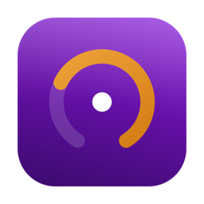
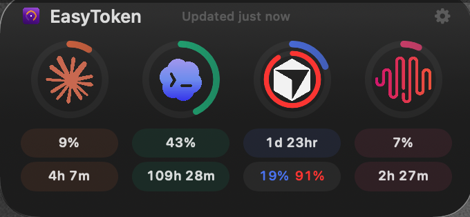
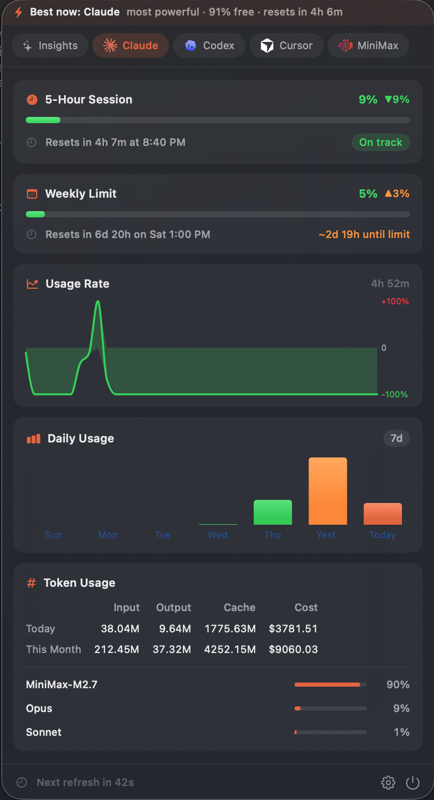
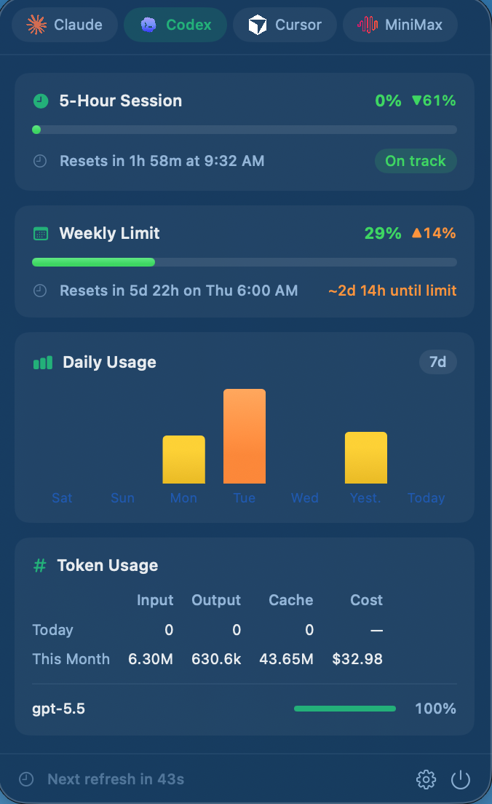
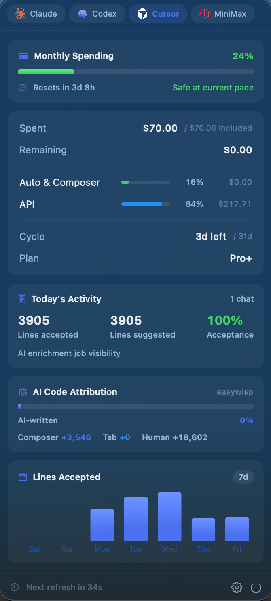
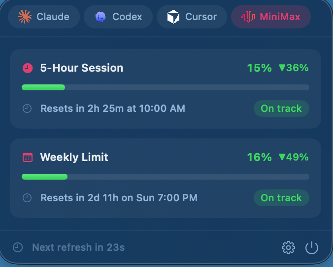
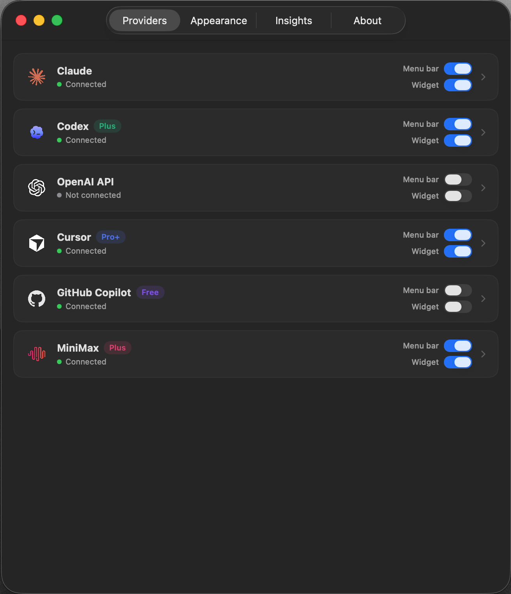
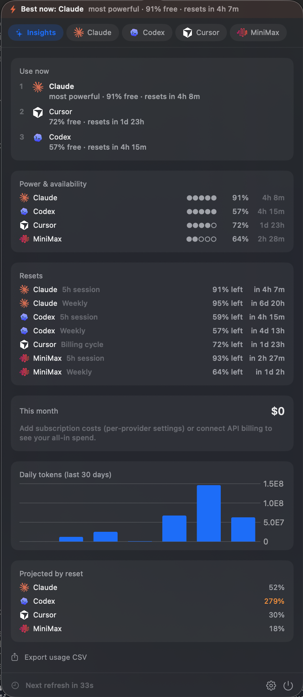

# EasyToken

### All your AI coding usage. One menu bar. One glance.

**EasyToken** is the macOS app that tracks how much of your AI coding tools you've used — **Claude, OpenAI Codex, Cursor, GitHub Copilot, and MiniMax** — all in one place. Live gauges in your menu bar, a rich popover with the full breakdown, a native desktop widget, and — when you want it — spend totals, alerts, forecasts, and trends across every tool. No spreadsheets, no guessing, no surprise limits.

[**⬇️ Download the latest version**](https://github.com/Pumpkin-Apps/easytoken-releases/releases/latest) &nbsp;·&nbsp; macOS 14 Sonoma or later &nbsp;·&nbsp; Apple Silicon + Intel

---

## Why EasyToken?

If you code with AI, you're juggling limits across half a dozen tools — Claude's 5-hour and weekly windows, Codex's rate limits, Cursor's monthly spend, Copilot quotas, MiniMax request windows. Each one lives behind a different dashboard, a different login, a different tab. **You find out you're throttled at the worst possible moment.**

EasyToken fixes that. It's the **one app focused entirely on multi-provider AI usage** — pulling every tool's numbers into a single, always-visible view so you always know exactly where you stand.

- 🎯 **Multi-provider, by design.** Claude, Codex, Cursor, Copilot, and MiniMax — together, side by side. This is the whole point of the app, not a bolted-on feature.
- 👀 **Easy to see.** Live percentage + time-remaining gauges sit right in your menu bar. Glance up, know instantly.
- 🖥️ **Easy to keep around.** A native macOS desktop widget puts your usage rings on your wallpaper or in Notification Center.
- ⚙️ **Easy to configure.** Connect each provider with a toggle, pick what each menu-bar gauge shows, and you're done.
- 🔒 **Private by default.** EasyToken reads your usage from local files and your own accounts. Your usage data stays on your Mac.

---

## See it in action

### 🧭 Menu bar — your usage, always one glance away

Every connected provider gets a compact live gauge in your menu bar: the metric you care about (5-hour session, weekly limit, monthly spend…) plus time until it resets. No clicking required — it's just *there*, all day.

### 📊 The popover — the full story, per provider

Click the menu bar and the popover opens with a tab for each provider. Every tool gets a tailored breakdown:

- **Claude** — 5-hour session and weekly (Max 5×) limits with exact reset times, a 7-day daily-usage chart, input/output/cache token counts, cost today vs. this month, and your model mix (Opus / Sonnet / etc.).
- **Codex** — 5-hour and weekly rate-limit windows, daily usage trend, token totals, and per-model breakdown — read straight from the Codex CLI.

- **Cursor** — monthly spending against your included budget, Auto/Composer vs. API usage split, billing cycle countdown, plan tier, today's acceptance rate, AI code attribution, and a lines-accepted chart.
- **MiniMax** — 5-hour session and weekly request windows with live reset countdowns.
- **GitHub Copilot** — quota and token usage pulled from your local editor logs.

### 🖥️ The desktop widget — usage rings, right on your desktop

A native WidgetKit widget shows a ring gauge per provider with its key number and reset time. Add it to your desktop or Notification Center and your AI usage is always in view — it updates automatically in the background.

### ⚙️ Settings — connect once, configure to taste

Flip a toggle to connect each provider. For most tools there's **nothing to copy-paste** — EasyToken reads what's already on your Mac. Per provider, choose exactly what the **menu bar** and **widget** display independently — show a provider in one surface, the other, or both.

---

## Power features — turn on what you want

EasyToken stays a clean at-a-glance tracker by default. Everything below is **opt-in** in Settings → Insights, so the classic menu bar and widget look exactly the same until you decide you want more.

### 🧮 Insights overview

One tab with your **all-in monthly spend across every tool** — subscription fees + API usage + overage, ranked — plus a **30-day usage trend chart**, **end-of-cycle forecasts** ("at this pace you'll hit your limit before it resets"), and a live **"best tool right now"** recommendation based on which connected tool has the most headroom.

- ⚡ **Best tool right now** — always shows which connected tool has the most headroom so you route work to whatever won't throttle you.
- 🔔 **Threshold alerts** — get a native notification before you hit a cap. Once per cycle, never spammy, never on stale data.
- 🌙 **Deep Work mode** — mute alerts while you're in the zone.
- 💡 **Right-sizing nudges** — gentle "paying for it, barely using it?" flags for subscriptions you've left idle.
- 📤 **Export** — one click to save your usage history as a CSV for your own analysis or expense reports.
- ⌨️ **Shortcuts & terminal** — a bundled `easytoken-cli` and Apple Shortcuts actions let you query usage or "best tool now" from the terminal, Raycast, Alfred, or a Shortcut.
- 🛟 **Never silently stale** — EasyToken tracks each provider's last successful update and clearly marks data as stale rather than showing you a confidently wrong number.

---

## Supported providers

| Provider | What you see | How it connects |
| --- | --- | --- |
| **Claude** (Claude Code / Claude.ai) | 5-hour + weekly limits, tokens, cost, model mix | Sign in with Claude Code — reads local session files, no API key |
| **OpenAI Codex** | 5-hour + weekly rate limits, tokens, models | Reads the Codex CLI's local session files — no login |
| **OpenAI API** | Monthly API spend vs. your budget, daily usage | Paste an org Admin key (optional) |
| **Cursor** | Monthly spend, plan, acceptance, code attribution | Stay signed in to Cursor — reads local data + your account |
| **GitHub Copilot** | Quota and token usage | Reads VS Code's local Copilot logs |
| **MiniMax** | 5-hour + weekly request windows | Quick in-app sign-in — no API key needed |

> Want true all-in spend? Add your flat monthly subscription cost per provider in Settings and the Insights overview combines it with API/overage charges for a real total.

---

## Getting started

1. [**Download the latest DMG**](https://github.com/Pumpkin-Apps/easytoken-releases/releases/latest).
2. Open it and drag **EasyToken** to your Applications folder.
3. Launch it — a friendly onboarding walks you through a quick email verification (**founding users lock in free lifetime access** when paid plans launch) and connecting each provider.
4. Open **Settings** to turn providers on/off, choose what each menu-bar/widget gauge shows, and flip on any Insights features you want.
5. (Optional) Right-click your desktop → **Edit Widgets** → search **"EasyToken"** to add the widget.

> 💡 Turn on **Launch at Login** in Settings so your gauges, widget, and alerts stay live in the background.

---

## Privacy

EasyToken is built to keep your data yours:

- Your **usage data stays on your Mac.** EasyToken reads it from **local files** your tools already write and from **your own signed-in accounts** — there's no EasyToken server collecting your activity.
- Credentials are stored on your Mac (in the system Keychain where applicable).
- The one thing you share is the **email you verify at setup**, used to send product updates and grant founding-user access — nothing about your actual usage.

---

## Updates

EasyToken updates itself automatically via [Sparkle](https://sparkle-project.org). When a new version ships, you'll be prompted inside the app — no need to come back here. This repository hosts the public update feed (`appcast.xml`) and the signed, **Apple-notarized** DMG downloads.

## Requirements

- **macOS 14 (Sonoma) or later**
- **Apple Silicon or Intel** (universal binary)
- Signed with a Developer ID and notarized by Apple

---

**EasyToken** — made by **Pumpkin Apps** 🎃

*Track every AI coding tool you use, in one easy place.*

